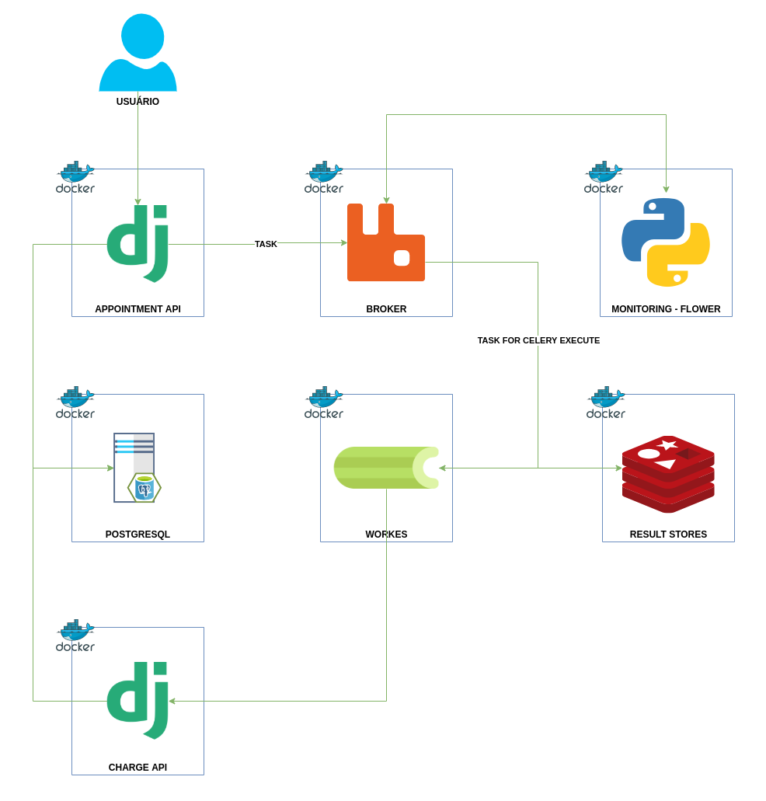
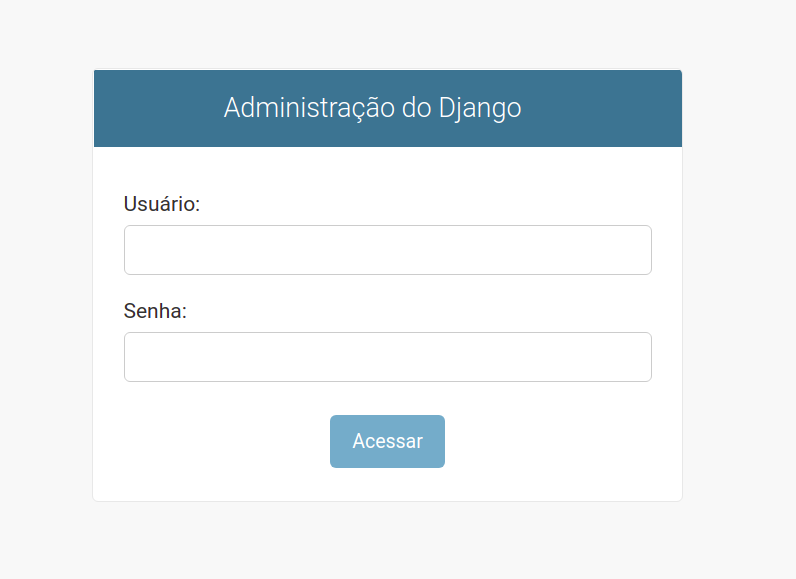
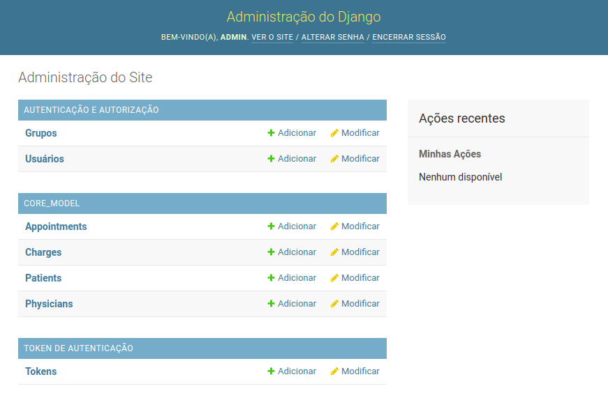

###########################
iClinic Teste SRE Arquiteto
###########################
 

Problema
########

`Acesse aqui a descrição do problema.`__

__ https://gist.github.com/rbouchabki/1c1e9826cbb6282c7ffd77703183f8f3

Solução
#######

Ferramentas utilizadas:

- `Django REST framework`__
- `PostgreSQL`__
- `RabbitMQ`__
- `Celery`__
- `Flower`__
- `Redis`__
- `Docker`__
- `Docker Compose`__

__ https://www.django-rest-framework.org
__ https://www.postgresql.org/docs/
__ https://www.rabbitmq.com/documentation.html
__ https://docs.celeryproject.org/en/stable/
__ https://flower.readthedocs.io/en/latest/
__ https://redis.io/documentation
__ https://docs.docker.com/
__ https://docs.docker.com/compose/

=================
**Inicializando**
=================

Pré-requisitos
--------------
- `Git`__
- `Docker compose`__

__ https://git-scm.com/book/en/v2/Getting-Started-Installing-Git
__ https://docs.docker.com/compose/install/

Clone repositório
-----------------

::

$ git clone git@github.com:andreclimaco/desafio_iclinic.git

Acesse o diretório
------------------

::

$ cd desafio_iclinic/

Execute o Docker Compose
------------------------

::

$ docker-compose build
$ docker-compose up -d

==========
**Testes**
==========

API de consultas
----------------

::

$ docker-compose run --rm appointment-api python manage.py test -v 2

API de cobranças
----------------

::

$ docker-compose run --rm charge-api python manage.py test -v 2

=======================================
**Acessando a Administração do Django**
=======================================

Pré-requisitos
--------------

Crie um super usuário
^^^^^^^^^^^^^^^^^^^^^

::

$ docker-compose run --rm appointment-api python manage.py createsuperuser

ou

::

$ docker-compose run --rm charge-api python manage.py createsuperuser

Acesse
^^^^^^
- http://localhost:9000/admin/

