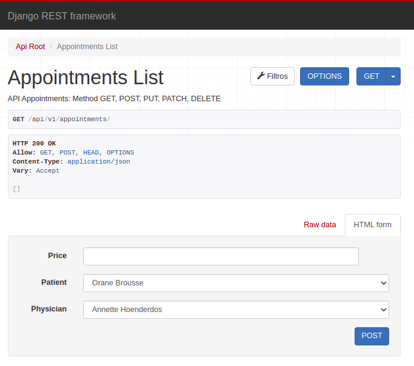
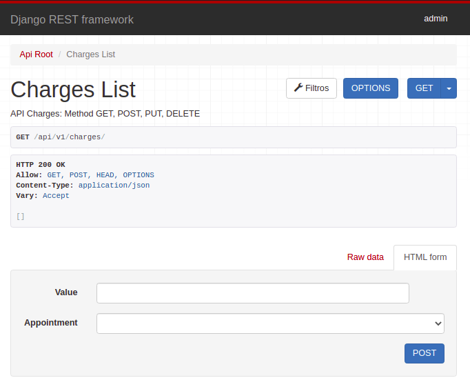
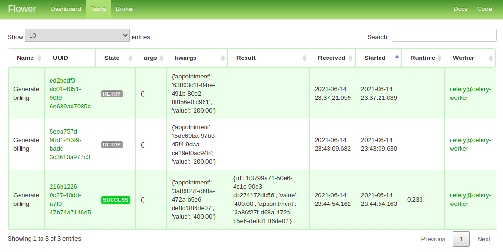

###########################
iClinic Teste SRE Arquiteto
###########################
 

Problema
########

`Acesse aqui a descrição do problema.`__

__ https://gist.github.com/rbouchabki/1c1e9826cbb6282c7ffd77703183f8f3

Solução
#######

Ferramentas utilizadas:

- `Django REST framework`__
- `PostgreSQL`__
- `RabbitMQ`__
- `Celery`__
- `Flower`__
- `Redis`__
- `Docker`__
- `Docker Compose`__

__ https://www.django-rest-framework.org
__ https://www.postgresql.org/docs/
__ https://www.rabbitmq.com/documentation.html
__ https://docs.celeryproject.org/en/stable/
__ https://flower.readthedocs.io/en/latest/
__ https://redis.io/documentation
__ https://docs.docker.com/
__ https://docs.docker.com/compose/

.. image:: docs/desafio_iclinic.png
  :width: 600
  :alt: Proposta de solução

=================
**Inicializando**
=================

Pré-requisitos
--------------
- `Git`__
- `Docker compose`__

__ https://git-scm.com/book/en/v2/Getting-Started-Installing-Git
__ https://docs.docker.com/compose/install/

Clone o repositório
-------------------

::

$ git clone git@github.com:andreclimaco/desafio_iclinic.git

Acesse o diretório
------------------

::

$ cd desafio_iclinic/

Execute o Docker Compose
------------------------

::

$ docker-compose build
$ docker-compose up -d

============
**Testando**
============

API de consultas
----------------

::

$ docker-compose run --rm appointment-api python manage.py test -v 2

API de cobranças
----------------

::

$ docker-compose run --rm charge-api python manage.py test -v 2

=============
**Acessando**
=============

**Administração do Django**
----------------------------

.. image:: docs/screenshot/django-admin-login.png
  :width: 600
  :alt: Login Django Admin

Pré-requisitos
--------------

Crie um super usuário
^^^^^^^^^^^^^^^^^^^^^

::

$ docker-compose run --rm appointment-api python manage.py createsuperuser

ou

::

$ docker-compose run --rm charge-api python manage.py createsuperuser

Acesse
^^^^^^
- http://localhost:9000/admin/

.. image:: docs/screenshot/django-admin.png
  :width: 600
  :alt: Django Admin

**API de Consultas**
--------------------

`Detalhamento da API de Consultas`__

__ appointment/README.rst#endpoints

- http://localhost:8000/api/v1/appointments/

**API de Cobranças**
--------------------

`Detalhamento da API de Cobranças`__

__ charge/README.rst#endpoints

- http://localhost:9000/api/v1/charges/

**Flower**
----------
- http://localhost:5555

==========
**Extras**
==========

- `Core Model`__
- `Dados iniciais`__

__ iclinic-core_model/README.rst
__ #dados-iniciais

Dados iniciais
--------------

.. list-table:: Pacientes
    :widths: 50 25 25
    :header-rows: 1

    * - id
      - first_name
      - last_name
    * - 01fcc220-49ee-4b9c-8a9a-0d5ea9a4293f 
      - Orane
      - Brousse
    * - 186718d0-97bb-4cf8-bfca-07e3f51b6f94
      - Tanguy
      - Barrette
    * - 44e56506-4ffe-4ab5-ab4f-3b31a4c88716
      - Loyal
      - Dubé
    * - 492ade75-58cf-404a-8ebe-8fcc601fb612
      - Émilie
      - Angélil
    * - 6ce6f569-6f5f-4a71-ab4b-f5caa0709ff0
      - Gabriel
      - Baril
    * - 7033474d-42a9-40d0-8a99-af727b2f93cb
      - Avice
      - Charpentier
    * - 826c8276-70c4-41fc-a81b-722983c47020
      - Troy
      - Cloutier
    * - 88a2a7d1-16f4-4f2f-b635-8adc70478770
      - Harbin
      - Viens
    * - 9518b7e1-b185-4d49-aaf5-f19a7c0b3c27
      - Alita
      - Boucher
    * - 954086a0-324a-4441-99d0-a61bb17a2bcd
      - Pomeroy
      - Pirouet
    * - b21e20fd-2e5f-48bb-a7bf-c439f882cb1a
      - Annette
      - Hoenderdos

.. list-table:: Medicos
    :widths: 50 25 25
    :header-rows: 1

    * - id
      - first_name
      - last_name
    * - b21e20fd-2e5f-48bb-a7bf-c439f882cb1a
      - Annette
      - Hoenderdos
    * - cf59267c-f4a4-4bee-abbb-c02af82dda89
      - Annefloor
      - Nooren
    * - d4feda94-cf49-4580-abe9-21fb02a9d5db
      - Raoul
      - Karel
    * - f7be9652-b0cb-4fc5-ad03-8ea0f20449ba
      - Yoni
      - Vianen