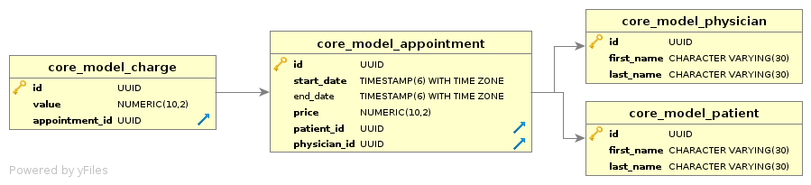

##########
Core Model
##########

Pacote responsável pelos modelos de dados

**********
Instruções
**********

Executar testes
===============

:: 

$ python manage.py test -v 2

Gerar distribuição
==================

Para adicionar aos projetos appointment e charge, uma nova versão do core_model, execute os comandos:

::

$ python setup.py sdist -d ../appointment/other_module/
$ python setup.py sdist -d ../charge/other_module/

